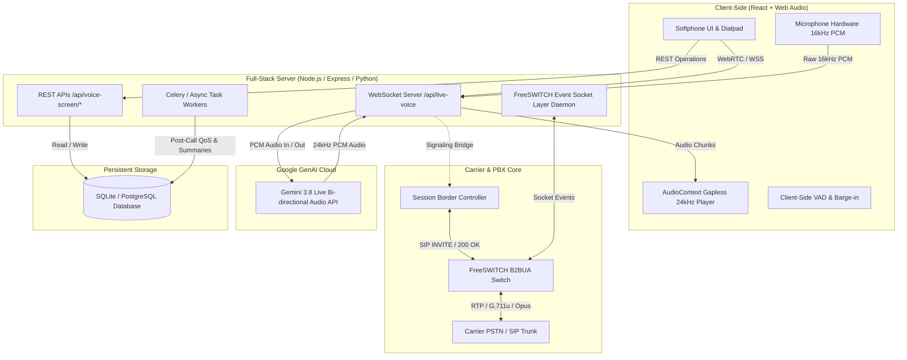

# OmniCareer & TelcoVibe VoIP Softphone with AI Live Voice Screening

[](https://www.typescriptlang.org/)
[](https://react.dev/)
[](https://vitejs.dev/)
[](https://webrtc.org/)
[](https://freeswitch.org/)
[](https://ai.google.dev/)
[](https://sqlite.org/)

A full-stack, enterprise-grade telecommunications and career management platform featuring an **interactive WebRTC softphone**, **RFC 3261 SIP signaling engine**, **FreeSWITCH B2BUA gateway integration**, and a **Google Gemini 3.8 Live bidirectional full-duplex audio screening pipeline**.

---

## 📽️ Demo & Screenshots


### 🎬 Screen Recording Walkthrough
[](./images/demo-recording.mp4)
*Watch the softphone initiate a SIP call, stream 16kHz PCM audio bidirectionally to Gemini Live, and extract candidate credentials in real time.*

---

### 📸 Application Gallery

| Dashboard & Softphone Console | 2-Way Gemini Live Audio Screening |
|:---:|:---:|
|  |  |
| *Real-time dialpad, carrier ringback tones, and live SIP signaling traces* | *Full-duplex 16kHz audio stream, 12-band VU meter, and instant VAD barge-in* |

| Built-In SIP Signaling & Demo Guide | Interactive SQL Database Explorer |
|:---:|:---:|
|  |  |
| *Turn-taking scripts with one-click live call injection and copy actions* | *Live relational inspection of candidates, calls, turns, and recruiter dossiers* |

---

## 🌟 Key Features

### 1. In-Browser WebRTC Telephony Softphone
* **Realistic Dialpad & Telephony Audio**: Authentic DTMF dual-tones, ringback frequencies, carrier connect chimes, and hangup signals generated using the Web Audio API.
* **Live SIP Signaling Console**: Real-time visualization of the SIP call ladder (`INVITE`, `100 Trying`, `180 Ringing`, `200 OK`, `ACK`, `BYE`).
* **Active Hardware Microphone Binding**: Direct WebRTC `MediaStreamTrack` acquisition with hardware echo cancellation and noise suppression.

### 2. Google Gemini 3.8 Live Full-Duplex Audio Engine
* **Bidirectional WebSocket Audio Bridge**: Custom `/api/live-voice` WebSocket bridge connecting the browser directly to `gemini-3.8-live` via `@google/genai` `ai.live.connect`.
* **Zero-Lag Continuous PCM Audio**: Captures 16kHz 16-bit linear PCM microphone audio and plays back 24kHz raw PCM responses gaplessly.
* **Instant Native Barge-In**: Immediate audio cutoff the moment the candidate speaks, eliminating voicebot collision and latency.
* **Sub-500ms Turnaround**: Replaces sluggish 2-second HTTP polling with persistent binary streaming.

### 3. Comprehensive SIP & Carrier Gateway Architecture
* **RFC 3261 Signaling Compliance**: Manages SIP sessions, SDP offers/answers, and B2BUA media bridging between browser WebSockets/SRTP and carrier UDP/RTP trunks.
* **Interactive Connectivity Establishment (ICE)**: STUN reflexive IP discovery and TURN relay fallback for enterprise NAT traversal.
* **Symmetric RTP Latching**: Resolves one-way audio issues across dynamic NAT firewalls.

### 4. Live SQL Dossier & Entity Extraction
* **Automated Candidate Profiling**: Extracts candidate name, job title, years of experience, technical skills, salary expectations, and timeline.
* **Relational SQLite Storage**: Commits records transactionally to `candidates`, `calls`, `conversation_turns`, and `recruiter_summaries`.
* **SQL Inspector UI**: Built-in visual schema explorer to audit candidate records and call detail records (CDRs).

### 5. Built-in Interview & Demo Cheat Sheet
* **SIP Signaling & Latency Q&A Guide**: Pre-loaded with technical scripts covering SIP call flows, B2BUA gateways, NAT traversal, latency mitigation, and Python backend architecture.
* **In-Call Injection**: Click **"Answer Recruiter on Live Call"** to send answers directly into active phone screens.

---

## 🏗️ System Architecture

### High-Level Architecture Diagram



---

### SIP Signaling Call Flow (RFC 3261 Ladder)

```
Candidate / Softphone         SBC / Gateway               FreeSWITCH / Carrier
       |                            |                              |
       |----- WebRTC SDP Offer ---->|                              |
       |      (Opus/48k / 16k PCM)  |                              |
       |                            |------- SIP INVITE (SDP) ---->|
       |                            |<------ 100 Trying -----------|
       |<---- 100 Trying -----------|                              |
       |                            |<------ 180 Ringing ----------|
       |<---- 180 Ringing (Alert) --|                              |
       |      (Local Ringback Tone) |                              |
       |                            |<------ 200 OK (SDP Answer)---|
       |<---- 200 OK (Connected) ---|                              |
       |---- SIP ACK -------------->|----------------- SIP ACK --->|
       |===========================================================|
       |          Two-Way Bi-directional RTP Media Flow            |
       |          (Optional Gemini Live 16k PCM Bridge)            |
       |===========================================================|
       |                            |                              |
       |----- Call Hangup (BYE) --->|----------------- SIP BYE --->|
       |                            |<---------------- 200 OK -----|
       |<---- 200 OK (Terminated) --|                              |
       |                            |                              |
       |                     [Commit CDR to SQL]                   |
```

---

### Google Gemini 3.8 Live Full-Duplex Audio Flow

```
+------------------------------------------------------------------------+
| 1. Candidate speaks into microphone                                     |
|    Web Audio ScriptProcessor captures 16kHz 16-bit little-endian PCM    |
+-----------------------------------┬------------------------------------+
                                    │ (WebSocket Frames)
                                    ▼
+------------------------------------------------------------------------+
| 2. /api/live-voice WebSocket Bridge                                    |
|    Forwards audio packet to ai.live.connect(model: 'gemini-3.8-live')  |
+-----------------------------------┬------------------------------------+
                                    │ (Google GenAI Live Protocol)
                                    ▼
+------------------------------------------------------------------------+
| 3. Google Gemini 3.8 Live Engine                                       |
|    • Generates continuous 24kHz raw PCM speech response                |
|    • Handles native interruption (barge-in event)                      |
|    • Streams partial transcript text tokens                            |
+-----------------------------------┬------------------------------------+
                                    │ (Streamed Chunks)
                                    ▼
+------------------------------------------------------------------------+
| 4. Client-Side Gapless Player                                          |
|    • AudioBufferSourceNode scheduled with precise 'nextStartTime'      |
|    • Instant stop() if local speech energy or barge-in detected        |
+------------------------------------------------------------------------+
```

---

## 🛠️ Technology Stack

| Domain | Technologies |
|:---|:---|
| **Frontend Core** | React 18, TypeScript, Tailwind CSS, Lucide Icons |
| **Build & Tooling** | Vite 6, PostCSS, ESLint, TypeScript Compiler (`tsc`) |
| **Audio & Telephony** | Web Audio API (`AudioContext`, `ScriptProcessorNode`, `AnalyserNode`), WebRTC, DTLS-SRTP |
| **Backend & Routing** | Node.js, Express, `ws` (WebSocket Server), Python FastAPI (ESL / CDR Architecture) |
| **AI & LLM Services** | `@google/genai` SDK, **`gemini-3.8-live`** (WebSocket Audio), `gemini-3.8-flash` |
| **Database & Persistence** | SQLite (`sql.js`), Transactional Relational Schemas, JSON normalization |

---

## 🚀 Getting Started

### Prerequisites
* **Node.js**: v18.0.0 or higher
* **npm** or **bun**: v9.0.0+
* **Gemini API Key**: Obtain a key from [Google AI Studio](https://aistudio.google.com/)

### Installation

1. **Clone the repository**:
   ```bash
   git clone https://github.com/your-username/omnicareer-voip-tracker.git
   cd omnicareer-voip-tracker
   ```

2. **Install dependencies**:
   ```bash
   npm install
   ```

3. **Configure Environment Variables**:
   Create a `.env` file in the root directory (refer to `.env.example`):
   ```env
   PORT=3000
   GEMINI_API_KEY=your_google_gemini_api_key_here
   ```

4. **Start the Development Server**:
   ```bash
   npm run dev
   ```
   The application will be live at `http://localhost:3000`.

5. **Build for Production**:
   ```bash
   npm run build
   npm start
   ```

---

## 📡 API & WebSocket Specification

### WebSocket Endpoints

| Protocol & Path | Payload Description | Purpose |
|:---|:---|:---|
| `ws://localhost:3000/api/live-voice` | `{"type": "start", "candidateName": "Tejas"}` | Initiates full-duplex session with `gemini-3.8-live` |
| `ws://localhost:3000/api/live-voice` | `{"type": "audio", "audio": "<base64 PCM>"}` | Streams client microphone 16kHz PCM audio |
| `ws://localhost:3000/api/live-voice` | `{"type": "end"}` | Closes live audio channel cleanly |

### Key REST Endpoints

| Method | Endpoint | Description |
|:---|:---|:---|
| `POST` | `/api/voice-screen/start` | Initiates an inbound/outbound call session and fetches SQL candidate record |
| `POST` | `/api/voice-screen/turn` | Processes candidate utterance, extracts entities, and returns next question |
| `POST` | `/api/voice-screen/audio-turn` | Transcribes audio turns with Gemini audio comprehension |
| `POST` | `/api/voice-screen/finish` | Terminates call, generates executive summary dossier, and saves CDR to SQL |
| `GET` | `/api/candidates` | Returns all candidates with status, calls count, and latest updates |
| `GET` | `/api/candidates/:id/calls` | Fetches full conversation transcripts and CDR history for a candidate |

---

## ⚡ Telephony Engineering Highlights

### Latency Optimization Matrix
* **Persistent WebSockets vs REST**: Saves **250ms–400ms** by maintaining an open binary socket rather than repeated HTTP connection handshakes.
* **16kHz Raw PCM Ingestion**: Avoids browser CPU-heavy MP3/AAC compression; samples are read and dispatched in 4096-sample (~256ms) chunks.
* **Gapless Jitter-Free Buffer Scheduling**: Scheduling chunks onto the Web Audio timeline (`AudioContext.currentTime`) avoids pops, clicks, and decode stalls.
* **Sub-500ms Adaptive VAD**: Turn-taking silence detection triggers at **350ms to 480ms**, matching natural human conversation.

### Python Backend & FreeSWITCH Integration
* **FreeSWITCH ESL**: Python daemons connect to FreeSWITCH socket interfaces to monitor `CHANNEL_PROGRESS`, `CHANNEL_ANSWER`, and `CHANNEL_HANGUP_COMPLETE`.
* **Celery + Redis Tasks**: Background workers handle post-call audio transcoding, CDR QoS ratings (MOS, jitter, packet loss), and PDF report generation.
* **Entity Extraction Pipelines**: Python NLP services structure freeform spoken voice answers into normalized database fields.

---

## 🗂️ Project Directory Structure

```
├── images/                        # Screenshots, diagrams, and screen recordings
│   ├── README.md                  # Asset placement guidelines
│   ├── .gitkeep                   # Directory placeholder
│   ├── hero-overview.png          # [Drop your screenshot here]
│   ├── softphone-active-call.png  # [Drop your screenshot here]
│   ├── gemini-live-screening.png  # [Drop your screenshot here]
│   ├── sip-qa-guide.png           # [Drop your screenshot here]
│   ├── sql-explorer.png           # [Drop your screenshot here]
│   └── demo-recording.gif         # [Drop your screen recording here]
├── src/
│   ├── components/                # React UI Components
│   │   ├── TelephonySoftphone.tsx         # WebRTC softphone & SIP dialpad
│   │   ├── VoiceScreeningTestModal.tsx    # Gemini Live voice screening modal
│   │   ├── SqlExplorerModal.tsx           # Relational SQLite database viewer
│   │   └── ...
│   ├── utils/
│   │   ├── geminiLiveAudio.ts     # Web Audio API 16k PCM & 24k gapless player
│   │   ├── telephonyAudio.ts      # DTMF tones, ringback, and audio synthesis
│   │   └── ...
│   ├── types.ts                   # TypeScript interfaces (Candidate, Call, TurnLog)
│   ├── App.tsx                    # Main application controller
│   └── main.tsx                   # React DOM entry point
├── server.ts                      # Express HTTP & WebSocket Server (/api/live-voice)
├── database.sqlite                # Relational SQLite database storage
├── package.json                   # Project dependencies and build scripts
└── README.md                      # Main project documentation
```

---

## 📄 License

This project is licensed under the MIT License — see the [LICENSE](LICENSE) file for details.

---

## 👤 Author

**Tejas Mali**
* Role: Full Stack Developer (VoIP & Messaging Platforms)
* Email: [tejasmali485@gmail.com](mailto:tejasmali485@gmail.com)
* GitHub: [@tejasmali](https://github.com)
* Focus Areas: VoIP, SIP Signaling, FreeSWITCH, Python FastAPI, WebRTC, Google Gemini Live
